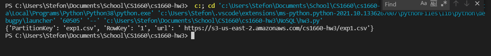

# CS1660 Homework 3
All images and additional files can be found in the NoSQL folder

## Container 1

1. Screenshot of query:

2. Screenshot of query output when running Python script: 

3. DPython and CSV files can be found in the NoSQL folder

