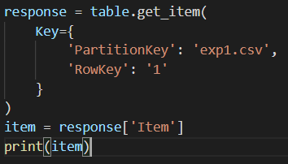

# CS1660 Homework 3
All images and additional files can be found in the NoSQL folder

1. Screenshot of query:

2. Screenshot of query output when running Python script: 

3. Python and CSV files can be found in the NoSQL folder. I omitted the AWS keys from my python files due to security concerns

